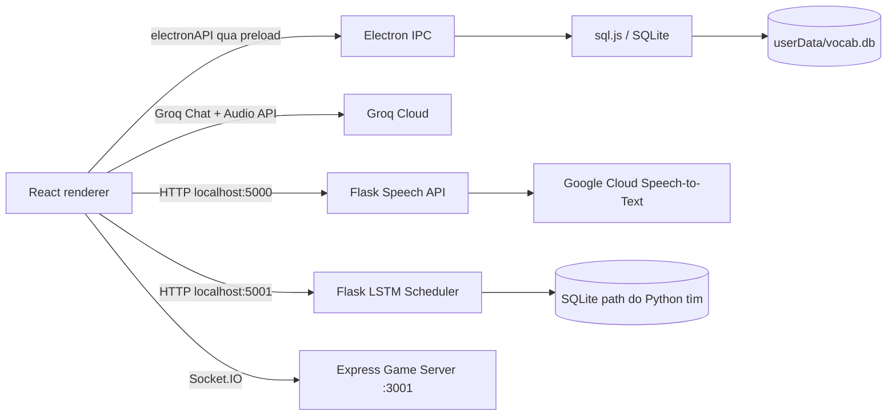

# Kiến trúc và dữ liệu

## Sơ đồ hệ thống

`LSTM` và `Speech API` là process riêng, không tự khởi động từ Electron. Multiplayer cũng là process riêng. Mỗi tích hợp có điều kiện chạy riêng; xem [Runbook](DEVELOPMENT_RUNBOOK.md).

## Luồng khởi động và database

1. `src/index.tsx` render `App`.
2. `App.tsx` gọi `dbService.connect()` khi khởi động và chuyển tới Dashboard.
3. `src/services/database.ts` đóng gói query rồi gọi `window.electronAPI`.
4. `electron/preload.js` expose các hàm `dbConnect`, `dbQuery`, `dbStatus`, `dbGetPath` qua `contextBridge`.
5. `electron/main.js` khởi tạo `sql.js`, mở hoặc tạo `${app.getPath('userData')}/vocab.db`, tạo các bảng cốt lõi và ghi file khi mutation xảy ra (cùng autosave mỗi 30 giây).

Electron bật `contextIsolation` và tắt `nodeIntegration` cho renderer. Lệnh query qua IPC là biên truy cập DB hiện tại. `database.ts` còn bộ chuyển một số cú pháp SQL Server sang SQLite vì một số trang dùng cú pháp cũ; engine thật ở đây vẫn là SQLite.

## Bảng SQLite được khởi tạo

| Bảng | Nội dung chính |
|---|---|
| `WordGroups` | Tên, mô tả, màu, icon và thời điểm tạo/sửa nhóm |
| `Words` | Từ/nhóm, nghĩa, IPA, từ loại, ví dụ, `Level`, `NextReview`, số lượt đúng/tổng |
| `StudySessions` | Phiên flashcard: mode, điểm, số từ, số đúng, thời lượng, group IDs |
| `GameScores` | Điểm game, level, số từ, accuracy, thời lượng |
| `UserSettings` | Key/value cho Groq key, daily goal, auto speak, auto vocab/category… |
| `DailyGoals` | Có schema trong Electron nhưng không thấy được dùng trong luồng hiện tại |

`Words.GroupId` tham chiếu `WordGroups.Id` với `ON DELETE CASCADE`. `foreign_keys` được bật khi DB mở. Không thấy migration/version table trong schema.

## SRS cơ bản

`calculateNextReview` trong `src/services/database.ts` dùng khoảng ngày `[1, 3, 7, 14, 30, 90]`. Mức được lưu là 0–5; đúng tăng tối đa 5, sai giảm tối thiểu 0. `FlashcardPage` cập nhật `Level`, `NextReview`, `TotalReviews`, `CorrectReviews` và tạo một hàng trong `StudySessions` khi hoàn tất lượt học.

## Nguồn dữ liệu theo tính năng

- **Từ, nhóm, setting, điểm**: SQLite trên máy người dùng.
- **AI Coach chat**: lịch sử trong `localStorage`, theo key `ai_coach_chat_history_<mode>`; API key nằm trong `UserSettings` của SQLite.
- **Groq AI vocab/MP3**: key `groq_api_key` đọc từ SQLite. Từ sinh được ghi vào nhóm mới trong SQLite. File MP3 được gửi lên API để chép lời nhưng bài nghe không thấy lưu trong DB.
- **Microphone**: audio đi từ renderer đến Flask `127.0.0.1:5000`, rồi Google Cloud; credential được cấu hình bằng `GOOGLE_APPLICATION_CREDENTIALS`.
- **Multiplayer**: client gửi từ vựng đến server qua Socket.IO; phòng và state game nằm trong RAM của server.
- **Scheduler**: client và Python đều trông đợi các bảng mở rộng; chi tiết thiếu hụt được ghi trong [Trạng thái](STATUS_AND_DECISIONS.md).

## Ranh giới API chính

| Tích hợp | Endpoint/transport | Dùng ở |
|---|---|---|
| Groq Chat | `https://api.groq.com/openai/v1/chat/completions` | AI Coach, tra cứu và sinh từ, sinh đáp án nghe, grammar check |
| Groq Transcription | `https://api.groq.com/openai/v1/audio/transcriptions` | MP3 Listening |
| Speech server | `POST http://localhost:5000/transcribe-blob`, `GET /health` | AI Coach microphone |
| Scheduler server | `GET http://127.0.0.1:5001/health`, `/daily-schedule`; `POST /predict-word` | Lịch ôn |
| Game server | Socket.IO mặc định `http://localhost:3001` | Multiplayer Hub và ba game mạng |
| Translate/Dictionary | Google Translate endpoint không khóa và `dictionaryapi.dev` | Tiện ích dịch/IPA trong AI Coach |

Groq key được lưu trực tiếp dạng setting trong SQLite. `GOOGLE_APPLICATION_CREDENTIALS` là cấu hình credential cho Google speech, không phải Groq key.
